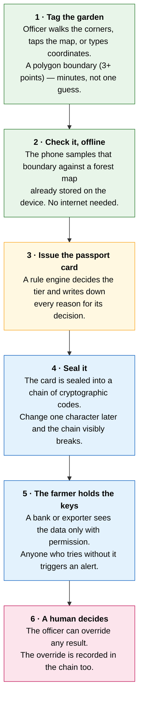
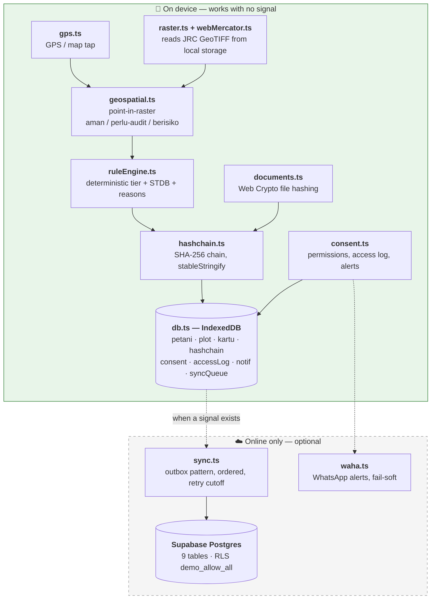

# 🌱 JejakHijau

**A data passport that makes smallholder farmers visible to the systems that decide their future — and keeps that data theirs.**

Built for **Garuda Hacks 7.0** · Track: **Agriculture & Food Systems** · Theme: *Secure Our Future*

> **Works with the internet switched off.** Every decision the system makes is deterministic and auditable. Nothing here is a black box.

---

## The 60-second version

Indonesian smallholders can't get credit, subsidies, or fair market access because their gardens were never officially recorded. They are **illegible** to the systems that decide their future.

Worse: the little data that *does* exist about them is held by other people. In **July 2026 in Jember, roughly 900 farmers' identities were used to take out fictitious loans** — the farmers found out only when the debts came due.

So the problem is two-sided, and solving only one half fails:

| The problem | What we do about it |
|---|---|
| Farmers aren't **legible** to institutions | Turn one GPS point into a verified garden profile in seconds — offline |
| Farmers aren't **sovereign** over their data | The farmer grants and revokes access; unauthorised access fires an alert |

**Who pays:** exporters, not farmers. Exporters face EU traceability rules (EUDR) and pay today for manual supply-chain verification. We make their suppliers traceable and cut that cost. Farmers pay nothing.

---

## How it works

The whole flow is six steps. An extension officer runs it on a phone in a field with no signal.



**Two tiers, because most farmers will never export:**

| Tier | Needs | Unlocks |
|---|---|---|
| **Lokal** (the majority) | Identity + garden boundary + ownership claim | KUR credit, subsidised fertiliser, government programmes, and identity protection |
| **Export-Ready** (premium) | + STDB permit + deforestation check + verification chain | Export traceability readiness, access to price premiums |

---

## The detail we're most proud of

The forest map we use (JRC Global Forest Cover 2020) is about **91% accurate, with an 18% commission error** — meaning shade-grown coffee, which grows *under* a tree canopy, is sometimes misread as forest.

A naive system would mark those farmers as deforestation risks and quietly deny them credit. **A statistical artifact would have cost a real person their loan.**

So the rule engine treats `perlu-audit` ("needs audit") as a **pass, not a fail** — it flags for human review instead of blocking:

```ts
// src/lib/ruleEngine.ts — 'perlu-audit' does NOT block the farmer
const ready = namaAda && koordinatValid && input.klaimKepemilikan
              && input.deforestasi !== 'berisiko';
```

Every card carries the reasons for its own decision (`alasan: string[]`), including the disclosure that the map may be wrong and why. The uncertainty is shown to the officer, not hidden from them.

---

## Run it

Verified from a clean clone. Requires **Node 20.19+ or 22.12+** (a Vite 8 constraint):

```bash
git clone https://github.com/codezeros18/MALUMALU.git
cd MALUMALU
npm install
npm run dev          # → http://localhost:5173
```

**No API keys needed for the core flow.** The entire field-officer journey below runs on-device against IndexedDB. Supabase and WhatsApp are optional (`.env.example`).

**A 3-minute tour — no configuration required:**

1. Open `/` — the landing page. Click **Masuk** ("enter"), pick the **Agen** (field officer) role.
2. **Turn your network off.** Everything below still works — this is the point.
3. **Tambah Plot** → tap/GPS/type at least 3 corners of the garden on the Pangalengan map → "Selesai Poligon" → save.
4. Upload the three required documents (KTP, land ownership proof, STDB) → the badge flips to *Berkas Lengkap*.
5. Create the card → read the tier and the reasons behind it.
6. Open the **hash chain** → *Verifikasi Rantai* → intact, entry by entry.
7. Grant consent to "Bank", then simulate an unauthorised access → an alert banner fires.
8. Switch to the **Petani** role → the farmer sees their own card and can revoke that consent themselves.

> **The Eksportir dashboard needs Supabase.** `/eksportir` and `/eksportir/terdekat` read Postgres directly and are online-only by design — an exporter is in an office, not a field. Add `VITE_SUPABASE_URL` and `VITE_SUPABASE_ANON_KEY` to `.env.local` to explore them. Steps 1–8 above need none of this.

| Route | Role |
|---|---|
| `/` · `/tentang` | Public landing |
| `/masuk` | Role selection |
| `/agen` · `/agen/tambah` · `/agen/plot/:id` · `/agen/petani` · `/agen/harga` | Field officer |
| `/petani` | Farmer portal — view own card, revoke consent |
| `/eksportir` · `/eksportir/terdekat` · `/eksportir/harga` · `/eksportir/paket/:kartuId` | Exporter dashboard, nearest-farmer search, reference pricing, EUDR evidence packet |

---

## What's real, and what isn't

We would rather you learn our limits from us than find them yourself.

| | Status |
|---|---|
| Offline point-in-raster, rule engine, hash-chain, consent | ✅ **Real** — verified with the network off |
| Tamper detection | ✅ **Real** — `verifyChain()` recomputes every entry's hash and reports the exact index where a mismatch occurs; no interactive "simulate tamper" button in the UI anymore |
| Supabase sync (outbox pattern, retry cutoff, conflict flagging) | ✅ **Real** — Playwright-verified against the live REST API |
| Nearest-verified-farmer search | ✅ **Real** — Turf.js distance, consent-gated |
| Deforestation map accuracy | ⚠️ **~91%, 18% commission error** — disclosed in-product, drives the audit-not-block rule |
| Plot geometry | ✅ **Real — polygon-primary** — single-point mode was removed; every new plot is a walked/tapped/typed boundary (3+ points, GPS/map-tap/manual coordinate entry), area and per-polygon deforestation risk (`getPolygonRisk`) computed from it. GPS still drifts 3–11 m per vertex under canopy — boundaries are a field estimate, not survey-grade |
| Risk mitigation guidance | ✅ **Real** — when a plot's risk is "sedang"/"tinggi", concrete mitigation actions (ground-truthing, buffer restoration, reforestation) surface automatically, with an officer-editable audit note |
| EUDR evidence packet | ✅ **Real** — exporters can generate a consent-gated "Paket Bukti Uji Tuntas" (geolocation + production period + document completeness + hash-chain integrity), explicitly labelled as supporting evidence, not an official DDS submission |
| Document files | ⚠️ **Hash + metadata only** — no Supabase Storage upload yet |
| Document verification | ⚠️ **Manual** — no OCR; `verified` is set by a human |
| Authentication | ⚠️ **Demo role-selector** — not real Supabase Auth |
| Row-level security | 🔴 **Mixed** — `hashchain`/`access_log`/`petani_document` are append-only (UPDATE/DELETE blocked at the database level); `petani`/`plot`/`kartu`/`transaksi`/`consent` remain `demo_allow_all` — real per-role RLS needs actual Supabase Auth first (`auth.uid()` is always null today) |
| Cross-device consent checks | ✅ **Real** — `isAuthorized()` checks Supabase first and falls back to local IndexedDB only when offline |
| WhatsApp alerts (WAHA) | ⚠️ **WhatsApp Web protocol** — ban risk at scale. Production needs the official Business API |
| e-STDB government integration | ⚠️ **Mocked and labelled** as such |
| Rupiah impact figures | ⚠️ **Labelled scenarios, not promises** |

**Technology is roughly 40% of this problem.** The other 60% is incentives, regulation, and payment rails — outside what any hackathon build can claim.

---

## Questions you're probably about to ask

<details open>
<summary><b>Why a hash-chain and not a blockchain?</b></summary>

A deliberate choice, not a shortcut. We need **tamper-evidence**, not distributed consensus. There is no untrusted-peer problem here — the officer's device writes, and anyone can verify later by recomputing SHA-256.

A blockchain would add a network dependency to a system whose entire premise is *working with no signal*, plus consensus costs and wallet UX for users who may not have reliable electricity. We took the property we needed and left the rest.

Each entry hashes `index | timestamp | dataHash | previousHash`. `verifyChain()` recomputes the whole chain and reports the exact index where it breaks. Payloads are serialised with a **recursive key-sorting stringifier** (`stableStringify`), because `JSON.stringify` doesn't guarantee key order — the usual silent bug in hand-rolled hash-chains.

📄 `src/lib/hashchain.ts`
</details>

<details open>
<summary><b>Where's the AI? Isn't this just rules?</b></summary>

Correct — and deliberately so. **The core is deterministic because these decisions gate someone's access to credit.** An LLM that hallucinates a deforestation status isn't a feature; it's a liability that a farmer pays for.

Every decision here is reproducible, auditable, and explains itself in plain Indonesian (`alasan: string[]`). Run it twice, get the same answer, and see exactly why.

The geospatial work — point-in-raster against GeoTIFF, Web Mercator projection, Turf.js distance — is real computational work. An LLM is scoped strictly to *drafting dossier text*, with a template fallback, disclosed in the UI, and is post-MVP. It never touches a decision.

📄 `src/lib/ruleEngine.ts`, `src/lib/geospatial.ts`, `src/lib/raster.ts`
</details>

<details open>
<summary><b>Why one point instead of a mapped polygon?</b></summary>

Under a coffee canopy, consumer GPS drifts **3–11 metres**. A polygon drawn from those readings would look rigorous and be wrong — false precision that gets trusted precisely because it looks exact.

A point is honest about what we actually know. Polygon mode exists (`src/lib/polygon.ts`) but is not the primary path.
</details>

<details open>
<summary><b>Is this compliance-driven, so what if the rules change?</b></summary>

Deliberately anti-fragile. EUDR is a tailwind, not the foundation. If export deadlines slip, the domestic value stands on its own: KUR credit and e-RDKK subsidised fertiliser both already require verified land data. Legibility opens replanting, subsidy, and financing regardless of what Brussels does.
</details>

---

## Architecture

Everything left of the dotted line runs **offline on the device**. Sync is an optimisation, never a dependency.



**Three engineering decisions worth a look:**

- **Sync ordering.** The outbox sorts by `createdAt`, not by key. Sorting by key shipped cards to Postgres before their parent plots existed — foreign-key violations. Found and fixed in Sprint 10.
- **Retry cutoff.** Permanently-failing records used to retry every 30 seconds forever, flooding the console. Now capped at 5 attempts, flagged `syncStatus: 'conflict'`, with a manual retry button.
- **Chain verification scope.** Chains are grouped and verified **per `agentId`** (per device), not per card. A per-card subset can't reach GENESIS if another entity was created first on the same device — an architectural trap we hit and documented rather than papered over.

Hard-won bug worth mentioning: `getDB()` cached its promise **even on rejection**, so one blocked IndexedDB upgrade poisoned every unrelated database call for the whole session. The tell was two completely unrelated features failing with identical errors. Fixed with `blocking()`/`blocked()`/`terminated()` handlers and a cache reset on failure.

### Stack

| Layer | Choice |
|---|---|
| Frontend | React 19 · Vite · TypeScript (strict) |
| Styling | Tailwind CSS |
| Maps | MapLibre GL · Turf.js |
| Raster | geotiff.js — JRC GFC2020, read offline |
| Local storage | IndexedDB (`idb`) |
| Crypto | crypto-js (SHA-256 chain) · Web Crypto (file hashing) |
| Offline | vite-plugin-pwa / Workbox |
| Backend *(optional)* | Supabase Postgres |
| Alerts *(optional)* | WAHA (self-hosted, Docker) |

### Repo map

```
src/
├── lib/          Core logic, no UI — the auditable brain
│   ├── geospatial.ts  raster.ts  webMercator.ts    point-in-raster
│   ├── ruleEngine.ts  (+ .test-cases.ts)           deterministic decisions
│   ├── hashchain.ts                                tamper-evidence
│   ├── consent.ts                                  permissions + alerts
│   ├── db.ts  sync.ts  supabaseClient.ts           storage + outbox
│   └── documents.ts  waha.ts  polygon.ts  gps.ts
├── pages/        TentangKami · Login · Agen · PetaniPortal · Eksportir
├── components/   Map3D · KartuCard · HashChainViewer · ConsentPanel
│   └── ui/       Button · Card · Badge · Input · Modal · …
docs/             Blueprint, architecture, MVP scope, full progress log
mobile/           Expo React Native client (see below)
```

---

## Mobile app (`mobile/`)

An **Expo / React Native** client covering the same six-step flow natively, for field officers who prefer an installed app over a PWA. Four tabs: *Lapangan* (field), *Kartu* (cards), *Rantai* (chain), *Izin* (permissions).

It shares the project's thesis and its honesty — the passport card renders the accuracy disclosure as visible fine print, not a buried footnote. It also carries a WhatsApp price-reference bot (`server/wahaWebhookServer.ts`).

**Status: secondary.** The web PWA is the primary submission and the more complete build — it has the three-role model, Supabase sync, and document verification. The mobile app is an offline-first field client and does not include those.

```bash
cd mobile && npm install && npx expo start
```

📄 `mobile/DEMO.md` — a rehearsed 3-minute demo script.

---

## Documentation

Written in Indonesian, kept as a genuine engineering record rather than a tidied-up story.

| Doc | What's in it |
|---|---|
| `docs/01_BLUEPRINT_FULL.md` | The full thesis, honestly scoped |
| `docs/02_TECH_ARCHITECTURE.md` | Architecture, data model, conventions |
| `docs/03_MVP_SCOPE.md` | What we built and what we deliberately cut |
| `docs/04_FULL_PRODUCTION_BLUEPRINT.md` | Post-MVP production design |
| `docs/06_PROGRESS_LOG.md` | **22+ sprints and post-sprint fixes, including every bug and wrong turn** |
| `docs/07_DOKUMEN_VERIFIKASI_BLUEPRINT.md` | Document verification design |
| `docs/09_UPGRADE_BLUEPRINT.md` | Post-MVP upgrade sprints: polygon risk score, real reference pricing, RLS hardening, WA bot hardening |

If you only read one, read the progress log. It records the mistakes too.

---

## Verification

Every sprint was verified in a real browser with **Playwright and headless Chrome** against a production build — not just `tsc` passing. That includes cross-sprint regression runs: Sprint 15 re-ran the entire offline MVP flow across all three roles to prove nothing had rotted.

Sync was confirmed by querying the **Supabase REST API directly**, not by trusting what IndexedDB reported.

```bash
npm run build     # tsc -b && vite build → PWA service worker
npm run lint      # oxlint
```

---

## Team

Built by **Team MALUMALU** for Garuda Hacks 7.0 — a fullstack engineer, an AI engineer, and a designer.

[@codezeros18](https://github.com/codezeros18) · [@KennyVWS](https://github.com/KennyVWS)

**Attribution:** Forest cover data © European Commission, Joint Research Centre — [JRC Global Forest Cover 2020](https://forobs.jrc.ec.europa.eu/GFC), open licence.

---

<div align="center">
<i>Farmers should be legible to the systems that judge them —<br/>and sovereign over the data that does the judging.</i>
</div>
